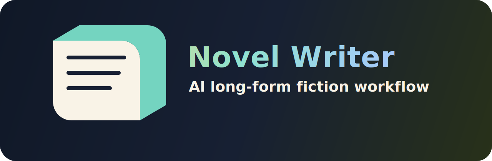

<p align="center">
  
</p>

<p align="center">
  <a href="README.zh-CN.md">中文</a> · <a href="README.md">English</a>
</p>

一个给 Codex、Claude Code 等 AI Agent 使用的长篇小说写作 Skill。

它不是让 AI 在一个聊天窗口里硬记整本书，而是把小说变成一个长期项目：设定库、大纲、章节合同、正文草稿、连续性审稿、素材池、状态账本，全都落在文件里。

## 项目初衷

AI 已经很会写一段像小说的文字，但长篇小说真正难在：

- 主线不能跑偏
- 人物不能前后割裂
- 伏笔不能忘
- 秘密不能提前暴露
- 章节不能只有事件，没有钩子
- 作者改稿习惯不能每次都重新教

这个 Skill 的目标是：让 AI 从“会写一段”变成“能协助长期连载”。

作者仍然是导演、第一读者和最终审稿人。AI 负责扩展脉络、生成章节合同、写初稿、做连续性审稿、维护状态账本，并从作者修改中学习偏好。

## 适合谁

- 想用 AI 写网文、长篇小说、系列故事的人
- 想让 AI 帮忙做大纲、人设、伏笔和章节合同的人
- 写了一段时间后发现 AI 容易忘人名、忘设定、改主线的人
- 想把 AI 写作流程开源、复用、教学的人
- 希望自己少改一点，但又不想完全放弃控制权的人

## 它能做什么

- 初始化完整小说项目结构。
- 维护 `canon/`、`outline/`、`memory/`、`drafts/`、`reviews/`、`research/`。
- 每章先生成“章节合同”，再写正文。
- 写完后自动做连续性审稿。
- 记录人物当前状态、关系变化、秘密知情范围、伏笔状态。
- 把作者修改习惯沉淀成 `author_editing_profile`。
- 可以做热点、热梗、平台钩子研究，但不会把网络段子硬塞进正文。

## 安装方式

把 `novel-writer/` 文件夹复制到你的 skills 目录。

Codex 常见路径：

```text
C:\Users\<你的用户名>\.codex\skills\novel-writer
```

Claude Code 常见路径：

```text
~/.claude/skills/novel-writer
```

如果没有识别，重启 Codex 或 Claude Code。

如果你的工具不支持自动加载 Skill，也可以手动打开 `novel-writer/SKILL.md`，把里面的核心规则复制到系统提示词或项目说明里，再把 `references/` 作为项目知识库使用。

## 使用方式

新建一个小说文件夹，在 Codex 或 Claude Code 里打开它，然后说：

```text
使用 novel-writer skill。

请初始化这个文件夹为长篇小说项目。
先不要写正文。
请先根据我提供的主题、脑洞、目标读者、雷点和结局倾向，生成 proposal。
未经我批准，不要写入 canon。
```

然后补充：

```text
主题：
脑洞：
类型：
目标读者：
主角：
反派：
我喜欢的作品：
我不想要的雷点：
结局倾向：
平台/篇幅目标：
```

## 适用于什么模型

这个 Skill 不绑定某一个模型。它适合所有能读取本地文件、写文件、遵循 `SKILL.md` 流程的 Agent。

推荐：

- Codex + 强推理/强代码模型
- Claude Code + Skills 支持
- 其他支持 `SKILL.md`、文件读写、长流程执行的 Agent

## 基本流程

1. 作者给主题、脑洞、目标读者、雷点、风格参考。
2. AI 先生成 proposal，不直接写入 canon。
3. 作者审批方向。
4. AI 把批准内容写入 `canon/` 和 `outline/`。
5. 每章先生成章节合同。
6. 作者批准章节合同。
7. AI 写正文。
8. AI 做连续性审稿。
9. 作者修改。
10. AI 分析作者修改，把偏好写入作者编辑画像。
11. 后续章节按这个画像继续写。

## 示例：《假如我成为了反派》

`examples/假如我成为了反派/` 里放了一个真实项目的结构化案例。

其中 `chapters/` 收录了前 11 章正文，方便使用者直接判断这个流程写出来的小说质感；`chapter-1-11-edit-analysis.md` 分析了这 11 章在因果逻辑、主角主动性、规则说明时机、章末钩子、反派组织可信度、夺舍后的代价等方面的修改方向。

## 许可证

MIT License。
